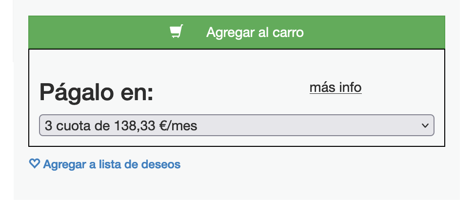

# SeQura Frontend Technical Test by Jean Osorio

## How to use the library
### Development Mode

You need to install the dependecies and then run the server with the following commands

```bash
npm install
npm start
```
During development mode the library is going  you would have two method available on the window:

#### totalAmount

This method allow you as a develper to send a amount and get a credit agreement. To use this command just write the following command on your browser console:

```javascript
SeQura.totalAmount(39999)
```

Paramether of the method is the total value of a product including the taxes and the last two digits represent the decimal numbers, i.e: 399,99  would be 39999.

> Just in case, is the user send the amount with comma or dot as decimal indicator, we are going to remove it, also you can sent the amount as a string

#### track

This method allow the user or the developer to send some metrics to backend endpoint. To use this method just write the followin on your command tab of your browser or from a method in :

```javascript
SeQura.track({"context":"checkoutWidget", "type":"simulatorInstalmentChanged", "selectedInstalment": 12})
```

> the track method always append the merchantId, so there no need to include it in the object data.

### Production Mode

> For the production mode we are assuming that the JS files is serve from http://locahost:8082

 1. install dependencies using the following commando 

```bash
npm install
``` 
 2. Generate the JavaScript file using the following command:

```bash
npm run build:prod
```
 3. Serve the library using the following command
```bash
npx http-server public -p 8082
```
4. Add the following tag to the head of your html page
```html
  <script type="text/javascript" src="http://localhost:8082/sequra.js"></script>
```
 5. Initialice the widget with the following commando (the merchandId is a random number to simulate a merchand identifier o merchan token in the SeQura enviroment). 
```html
  <script type="text/javascript">
    SeQura.init({merchantId: "1a2b3c4d5e6f7g8h9i"});
  </script>
```
 6. Add the following div with the id `SeQura` where do you want the SeQura widget it is going to appear. i.e.:
```html
<div id="SeQura"></div>
```
 7. When the page is ready you should send the initial amount of the product in order to get a SeQura credit agreement, i.e.:

```javascript
 SeQura.totalAmount(39999);
```
then you would see something like this:



8. if the product price change you have to call the `SeQura.totalAmount` method in order to get a new credit agreetment for the new total price of the product. i.e.:

```javascript
const currentPrice = $(this).attr("data-price").replace(" €", "");
SeQura.totalAmount(currentPrice);
```

another example:

```javascript
SeQura.totalAmount(45000);
```


## How the widget works

The library expose and populate the window object with the following method:

 - SeQura.init
 - SeQura.totalAmount
 - SeQura.track
 - SeQura.unmount

#### SeQura.init
This method is in charge of mounting the widget inside the web page, it needs two this: a `div` element with the id `SeQura` and object for the initial configuration with the `merchantId`  
|Argument|Type|Description|
|--|--|--|
|config|object(required)  |Allow to send the initial configuration of the widget, for example de merchantId|

use it like so:
```javascript
const config = {
	merchantId: "1a2b3c4d5e6f7g8h9i"
};
SeQura.init(config);
```

#### SeQura.totalAmount
This method is in charge of request the credit agreement base on the amount send it as argument and show the results in the widget.

> This is a memoize method, so if you ask for an amount that is already
> requested we return the response it is already on memory.

|Argument|Type|Description|
|--|--|--|
|amount|string or integer (required)  |total amount of the product including the taxes|

use it like so:
```javascript
SeQura.totalAmount(39999);
SeQura.totalAmount(45000);
SeQura.totalAmount(450,00);
SeQura.totalAmount(399.99);
SeQura.totalAmount("399.99");
SeQura.totalAmount("450,00");
```

#### SeQura.track
This method is in charge of send it metrics to the backend.

|Argument|Type|Description|
|--|--|--|
|data|object (required)|this information is going to be send it to the backend|

> This method would append the `merchantId`to the payload before send the data to the backend

use it like so:
```javascript
SeQura.track({"context":"checkoutWidget", "type":"simulatorInstalmentChanged", "selectedInstalment": 12})
```

#### SeQura.unmount
This method would remove manually the widget from the website.

> This method also remove the listener that wait for the DOM to be ready so you has to refresh the web page in order to mount the widget again

use it like so:
```javascript
SeQura.unmount()
```

### Things I would like to improve

 1. The track method immediately send the data to the backend, so it would be better to create a buffer to stack the metrics and when the buffer have an specify size send the data to the backend.
 2. I use styled components, so I could allow the user to send a object with a style theme in order to allow the widget show colors or fonts of the merchant web site.
 3. It took me more than 3 hours to complete the test, so I decide to skip the test, but I could make some test usint react-testing-library or cypress or puppeteer.
 4. naming, I don't feel confortable with the `totalAmount` name, maybe `getCreditAgreement` would be a better name.

### TODO List

- [X] Create a library without using create-react-app
- [X] Expose an init method to allow merchant to initialize the library with a tokenId
- [X] Expose an unmount method to remove react component library on merchant product page
- [X] Expose a track method to allow merchant to send event to event API
- [X] Espose a totalAmount to allow merchant to request a financial value
- [X] Show select and modal component as show in mockup file
- [ ] Allow merchant to styled the components
- [ ] Create a buffer using a weakMap for the track method instead of sending the events instantly


